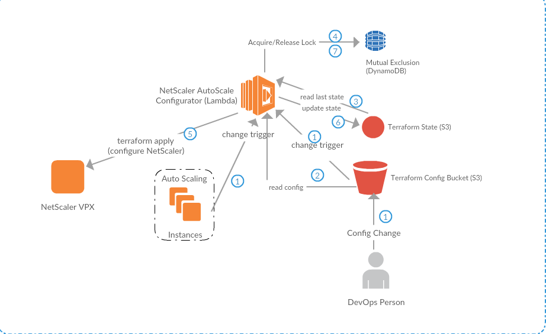

# Automate NetScaler configuration in AWS using AWS Lambda
Provides a [AWS Lambda](https://aws.amazon.com/lambda) function to manage the configuration of [Citrix NetScaler VPX instances in AWS](https://aws.amazon.com/marketplace/seller-profile?id=fb9c6078-b60f-47f6-8622-49d5e1d5aca7). The idea is to automate the reconfiguration of the NetScaler VPX when it load balances to a set of backend instances in an [AutoScaling Group (ASG)](https://aws.amazon.com/autoscaling/). As the ASG shrinks and expands, the lambda function reconfigures the NetScaler VPX appropriately.


# Theory of operation
The lambda function is bundled with a natively compiled [Terraform](https://terraform.io/) [provider](https://github.com/citrix/terraform-provider-netscaler) that can configure Citrix NetScaler using [the Nitro API](https://docs.citrix.com/en-us/netscaler/11/nitro-api.html). AWS Lambda functions can execute [natively compiled executables](https://aws.amazon.com/blogs/compute/running-executables-in-aws-lambda/). The lamdba function is configured to react to two sources of events:

* an S3 bucket that holds the terraform config file that configures the NetScaler
* Autoscaling events for the target ASG

When these events happen, the lambda function is invoked. The lambda function downloads the config file from the S3 bucket, the previous [tfstate](https://www.terraform.io/docs/state/) file from another S3 bucket and [applies](https://www.terraform.io/docs/commands/apply.html) the configuration to the NetScaler VPX. To discover the set of VPXs that it needs to configure, the lambda function searches for a particular instance tag. After successfully configuring the VPX(s), the lambda function uploads the new tfstate file to S3. Since multiple events (especially autoscale events) could happen very near each other, we have to protect from concurrent executions of the lambda instance. We use a [mutex implemented using DynamoDB](https://github.com/chiradeep/lambda-mutex)  to protect the critical section that configures the NetScaler.




# Pre-requisites

* VPC with VPC endpoint to S3
* VPC must have NAT gateway and at least 1 private subnet. Ideally the NetScaler VPX will have its own private management subnet for [NSIP address] (https://docs.citrix.com/en-us/netscaler/11/networking/ip-addressing/configuring-netscaler-owned-ip-addresses/configuring-netscaler-ip-address.html)
* [Terraform](https://terraform.io) on your local machine to automate the deployment of the lambda function.


# Usage
## Environment variables
Update the `S3_TFCONFIG_BUCKET` environment variables in the `.env` file. Then source it

```
source .env
```


## Creating the lambda function
To deploy the lambda function, use the Terraform config in [./lambda-resources](./lambda-resources). Or, use the Makefile:

```
make  create-lambda
```

The terraform config expects a number of inputs such as the VPC configuration, the tag on the NetScaler VPX instance, etc. This can be suppliedon the command line, or in the [terraform.tfvars](./lambda-resources/terraform.tfvars) file. The set of inputs is documented in [variables.tf](./lambda-resources/variables.tf).
An example of using the command line:

```
terraform apply -var 'autoscaling_group_backend_name=my-scaling-group' -var 'netscaler_vpc_id=vpc-a71cb1de' -var 'netscaler_vpc_subnet_ids=["subnet-3abce531"]' -var 'netscaler_security_group_id=sg-a34d49ab'
```

Make sure the `s3_config_bucket_name` variable matches the `S3_TFCONFIG_BUCKET` enviroment variable.

## Configuration of the NetScaler VPX
The Terraform config that configures the NetScaler should be in the [./config](./config) subdirectory. An example is provided. To make changes and upload the config, use

```
make update-config
```

This should upload a `config.zip` file to the S3 config bucket, which should then trigger the lambda function.

# Workflow
Once the lambda function is created and the initial terraform config has been uploaded, the DevOps team can make changes to the config using `make update-config`. An alternative is to have a separate git repository for the config and use Git webhooks to update `config.zip` in the S3 bucket. Github webhooks can be [automated using](https://aws.amazon.com/blogs/compute/dynamic-github-actions-with-aws-lambda/) AWS lambda as well.

# Troubleshooting
Use CloudWatch logs to troubleshoot. The output of `terraform apply` is buried between the mutex acquire and release logs.

# Development notes
Use `make update-lambda` to update the lambda function when you change the code in `handler.py`. Use `make invoke-lambda` to test the function independent of any events. 
Testing locally using `make test-local` is a little bit involved. You have to set up the environment variables expected by the lambda function, and then fake the actual execution of the terraform apply (replace bin/terraform with a simple shell script)


# Resources used
The monetary cost should be zero or close to it.

* A DynamoDB table to hold the mutex (low throughput: 2 writes/sec)
* Lambda execution. The number of executions is controlled by the number of scaling events and the number of config changes. Generally this should be in the free tier.
* S3 usage to hold the tfstate file and config file. This should be in the single-digit KB range.
* IAM permissions

# Cleanup
Use `terraform destroy` to destroy the resources created by `make create-lambda`.

# TODO

* Add SNS notifications on failure
* Create custom cloudwatch metrics such as number of mutex acquisition failures.
